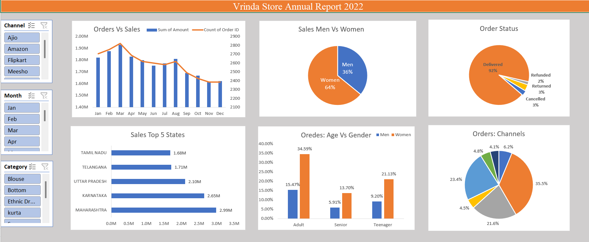

#  Vrinda Store Sales Analysis (Excel Dashboard)

##  Project Overview

This project analyzes **Vrinda Store's annual sales data (2022)** to uncover customer behavior, sales trends, and business insights.
The goal is to help the business make data-driven decisions to **increase sales in 2023**.

---

##  Tools Used

* Microsoft Excel
* Pivot Tables
* Pivot Charts
* Slicers
* Data Cleaning & Transformation

---

##  Dashboard Preview

---

## Key Insights

### 1. Sales Trend

* Sales peak observed around **March–April**
* Gradual decline in later months

### 2. Customer Demographics

* **Women contribute 64%** of total sales
* Men contribute 36%

### 3. Order Status

* **92% orders successfully delivered**
* Very low return & cancellation rate

### 4. Top Performing States

* Maharashtra → Highest sales
* Karnataka & Uttar Pradesh follow

### 5. Age Group Analysis

* Adult women contribute the highest share
* Teenagers and seniors contribute less

### 6. Sales Channels

* Major contribution from platforms like:

  * Amazon
  * Flipkart
  * Ajio

---

##  Business Recommendations

* Focus more on **female customers (targeted marketing)**
* Increase inventory before **peak months (Feb–Apr)**
* Expand operations in **top-performing states**
* Improve marketing for underperforming channels

---

##  Dataset

The dataset includes:

* Order ID
* Customer details
* State
* Category
* Sales amount
* Order status

---

##  How to Use

1. Download the Excel file
2. Open in Microsoft Excel
3. Use slicers to filter by:

   * Month
   * Channel
   * Category

---

##  Conclusion

This dashboard provides a clear understanding of sales performance and customer trends, helping Vrinda Store optimize strategy for future growth.

---

## Author

**Riya Ramteke**
Aspiring Data Analyst
